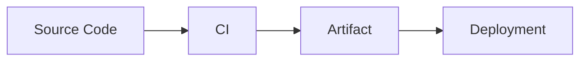

# Contributing

Thank you for contributing to the Platform Engineer Blueprint. This repository is intended to become a durable public knowledge base, so contributions should be clear, accurate, polished, and useful to readers who are building long-term platform engineering judgment.

## Repository Philosophy

This repository values:

- Durable mental models over short-lived tool instructions.
- Clear explanations over jargon.
- Production reality over marketing language.
- Structured learning over disconnected notes.
- Explicit tradeoffs over one-size-fits-all recommendations.
- Accurate documentation that can be read independently on GitHub.

Contributions should improve the repository without weakening the structure of the frozen [Blueprint v0.1](docs/BLUEPRINT-v0.1.md).

## Repository Conventions

- Use GitHub Markdown for all documentation.
- Keep documents professional and publication-ready.
- Use relative links for internal repository references.
- Keep chapter content aligned with the directories under `docs/`.
- Do not introduce incomplete draft content.
- Do not add unresolved work notes.
- Do not change the meaning or structure of Blueprint v0.1 unless the repository explicitly adopts a new blueprint version.
- Prefer concise, precise headings that match the subject being explained.
- Explain acronyms on first use when they may be unfamiliar to the target reader.

## Branch Naming

Use descriptive branch names that identify the type of change and the topic.

Recommended patterns:

- `feature/<topic>` for new documentation or major additions.
- `fix/<topic>` for corrections.
- `docs/<topic>` for documentation-only refinements.
- `chore/<topic>` for repository maintenance.

Examples:

- `feature/software-delivery-overview`
- `fix/system-map-links`
- `docs/contributing-guidance`
- `chore/markdown-formatting`

## Commit Message Style

Use clear, imperative commit messages that describe the change.

Preferred style:

```text
Add system map production flow
Improve contribution guidelines
Fix blueprint anchor links
```

A good commit message should make sense in this sentence: "This commit will ...".

## Pull Request Workflow

1. Create a topic branch from the current base branch.
2. Make focused changes that are easy to review.
3. Confirm Markdown renders correctly.
4. Check internal links and Mermaid diagrams.
5. Open a pull request with a clear title and summary.
6. Describe the files changed and the reason for the change.
7. Respond to review feedback with additional commits.

Pull requests should avoid mixing unrelated topics. A documentation structure change, a new chapter draft, and a typo cleanup are usually easier to review as separate changes.

## Markdown Conventions

- Use one top-level `#` heading per document.
- Use sentence-style headings unless a proper noun requires title case.
- Keep heading levels sequential.
- Use fenced code blocks with a language identifier when appropriate.
- Use tables for compact reference material.
- Use bullet lists for scannable guidance.
- Use numbered lists for ordered workflows.
- Use relative links for repository files.
- Keep line length readable, but prioritize natural Markdown editing over rigid wrapping.

## Mermaid Usage

Mermaid diagrams are encouraged when they clarify relationships, flows, boundaries, or feedback loops.

Guidelines:

- Use fenced `mermaid` code blocks.
- Keep diagrams readable in GitHub's renderer.
- Prefer simple flowcharts for process explanations.
- Use short node labels.
- Explain the diagram in surrounding text.
- Keep diagrams synchronized with the written content.

Example:



## Documentation Quality Bar

Before submitting, verify that the contribution:

- Has a clear purpose.
- Uses accurate terminology.
- Fits the existing repository structure.
- Does not duplicate existing explanations unnecessarily.
- Does not rely on unexplained tool-specific assumptions.
- Includes links only when they are valid and useful.
- Avoids incomplete language and unresolved notes.
- Can be understood by a reader who arrives directly from GitHub search.

## Preserving Blueprint v0.1

Blueprint v0.1 is frozen. Contributions may add supporting documentation, lessons, examples, diagrams, and refinements around it, but they should not alter its chapter architecture unless the repository intentionally creates a later blueprint version.

When in doubt, treat [docs/BLUEPRINT-v0.1.md](docs/BLUEPRINT-v0.1.md) as the source of truth for chapter scope.
