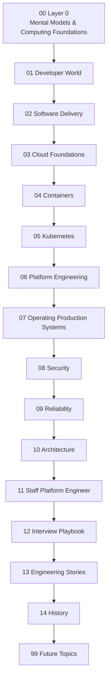

# Platform Engineer Blueprint

The Platform Engineer Blueprint is a long-term public knowledge base for engineers who want to understand how modern software systems move from an idea to reliable production operation.

It is organized as a structured learning path rather than a loose collection of notes. Each chapter builds context for the next one, connecting developer workflows, delivery systems, cloud infrastructure, containers, Kubernetes, platform engineering, operations, security, reliability, architecture, leadership, interviews, engineering stories, history, and future topics.

## Project Vision

The vision of this repository is to make platform engineering understandable from first principles.

Platform engineering is not a single tool, team name, or product category. It is the practice of designing internal systems that help software teams deliver and operate services safely, consistently, and efficiently. This blueprint explains the foundations behind that practice so learners can reason about real production systems instead of memorizing isolated commands.

## Why this repository exists

Modern engineering organizations rely on many connected systems: source control, CI, build tooling, artifact storage, container registries, infrastructure automation, deployment platforms, observability, incident response, security controls, and reliability practices. These topics are often taught separately, which makes it hard to understand how the whole system works.

This repository exists to provide a coherent map across those domains. It is intended to answer three recurring questions:

1. What happens between an idea and production?
2. Which systems participate in that journey?
3. What should a platform engineer understand at each layer?

The repository begins with the frozen [Blueprint v0.1](docs/BLUEPRINT-v0.1.md), the [System Map](docs/SYSTEM-MAP.md), and a roadmap for future documentation.

## Who should use it

This repository is useful for:

- Software engineers who want to understand delivery, infrastructure, and operations.
- DevOps engineers moving toward platform engineering.
- Site reliability engineers who want a broader product-and-platform view.
- Cloud engineers who want to connect infrastructure work to developer experience.
- Engineering managers and technical leads who need a clear language for platform capabilities.
- Interview candidates preparing for platform, infrastructure, DevOps, SRE, or staff engineering roles.
- Mentors building structured learning plans for teams.

## Learning Philosophy

The blueprint follows a layered learning philosophy:

- **Start with mental models.** Tools change, but systems thinking remains useful.
- **Connect every concept to the delivery path.** A topic matters because it affects how software is built, shipped, operated, secured, or improved.
- **Separate architecture from lessons.** The blueprint defines what should be learned; lessons can later teach each subject in depth.
- **Prefer production reality over tool marketing.** The repository emphasizes tradeoffs, failure modes, ownership, and operational behavior.
- **Build from fundamentals to staff-level judgment.** Learners should progress from basic computing concepts to technical leadership and architectural decision-making.

## Blueprint Structure



The canonical chapter definitions are maintained in [docs/BLUEPRINT-v0.1.md](docs/BLUEPRINT-v0.1.md). The end-to-end production flow is described in [docs/SYSTEM-MAP.md](docs/SYSTEM-MAP.md).

## Repository Structure

```text
.
├── README.md
├── ROADMAP.md
├── CONTRIBUTING.md
├── CHANGELOG.md
└── docs/
    ├── BLUEPRINT-v0.1.md
    ├── SYSTEM-MAP.md
    ├── 00-layer-0/
    ├── 01-developer-world/
    ├── 02-software-delivery/
    ├── 03-cloud-foundations/
    ├── 04-containers/
    ├── 05-kubernetes/
    ├── 06-platform-engineering/
    ├── 07-operating-production/
    ├── 08-security/
    ├── 09-reliability/
    ├── 10-architecture/
    ├── 11-staff-platform-engineer/
    ├── 12-interview-playbook/
    ├── 13-engineering-stories/
    ├── 14-history/
    └── 99-future-topics/
```

The numbered directories reserve stable locations for future chapter material. Blueprint v0.1 itself is intentionally limited to chapter descriptions and does not contain lessons.

## Learning Workflow

Recommended workflow:

1. Read the [System Map](docs/SYSTEM-MAP.md) to understand the full path from idea to production.
2. Read [Blueprint v0.1](docs/BLUEPRINT-v0.1.md) to understand the learning architecture.
3. Follow the chapters in order when building foundational knowledge.
4. Revisit the System Map after each chapter and connect the new concepts to the end-to-end flow.
5. Use the roadmap to understand what documentation is complete and what is planned next.

## Roadmap

The project roadmap is maintained in [ROADMAP.md](ROADMAP.md). The Foundation milestone is complete in version 0.1.0, establishing the repository documentation, blueprint definition, system map, contribution process, and changelog.

## Contribution Process

Contributions should preserve the repository's role as a polished public knowledge base. Before contributing, read [CONTRIBUTING.md](CONTRIBUTING.md) for branch naming, commit style, Markdown conventions, Mermaid usage, and pull request expectations.

## License

This repository is intended for public learning and knowledge sharing. See the repository license file when present for the authoritative license terms.
