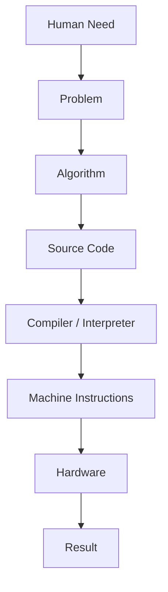

# Why does software exist?

Software exists because humans need machines to perform useful work without rebuilding the machine for every new problem.

Before learning programming languages, operating systems, containers, Kubernetes, or cloud platforms, it helps to understand the reason all of those layers exist. Software is not magic and it is not only code. Software is a way to turn human intent into repeatable machine behavior.

This lesson is the first Layer 0 lesson in the Platform Engineer Blueprint. It connects to the idea-to-production flow in the [System Map](../SYSTEM-MAP.md): an idea becomes requirements, source code, build artifacts, deployment, production behavior, and operational feedback.

## Learning Objectives

After this lesson, you should be able to:

- Explain why humans created software.
- Describe the problem software solves for people and organizations.
- Explain why hardware alone is not enough for most modern work.
- Describe abstraction as a way to manage complexity.
- Explain why operating systems exist.
- Explain why programming languages exist.
- Connect software fundamentals to continuous integration, containers, Kubernetes, cloud, and platform engineering.

## Why this matters

Platform engineers work several layers above raw hardware, but those layers still depend on the same basic chain: a human need is translated into instructions that a machine can execute.

When a deployment fails, a container will not start, a build produces the wrong artifact, or a Kubernetes workload cannot reach a dependency, the problem often becomes easier to reason about if you can trace the abstraction stack downward. The names change, but the pattern stays the same:

- A person or system wants an outcome.
- Software represents the desired behavior.
- Tools translate that representation into executable form.
- Hardware performs physical operations.
- The result is observed, measured, and improved.

Understanding this chain helps platform engineers avoid memorizing tools as isolated facts. CI, containers, Kubernetes, and cloud services are all software systems that exist to solve human coordination, repeatability, reliability, and scale problems.

## Mental model

The simplest mental model is:

> Key idea: software is encoded decision-making that lets hardware serve human needs repeatedly.

A computer is a general-purpose machine. By itself, it does not know whether it should calculate payroll, route network packets, display a web page, run a database, or deploy an application. Software gives the machine a precise set of rules for a desired outcome.

Think of the relationship like this:

| Layer | Role | Example |
| --- | --- | --- |
| Human need | The reason work should happen | A customer wants to transfer money. |
| Problem | The need expressed as something to solve | Move funds safely between accounts. |
| Algorithm | The steps and decisions | Validate identity, check balance, update records, emit confirmation. |
| Source code | Human-readable representation | Application code and tests. |
| Compiler or interpreter | Translation mechanism | Turn source code into executable behavior. |
| Machine instructions | CPU-level operations | Load, compare, branch, store. |
| Hardware | Physical execution | CPU, memory, disk, network devices. |
| Result | Observable outcome | The transfer succeeds, fails safely, or produces an error. |

The higher layers are easier for humans to understand. The lower layers are closer to what the machine can execute. Software engineering is largely the discipline of building useful, reliable bridges between those layers.

## Historical perspective

Early computing machines were often configured physically. People changed wiring, switches, punched cards, or machine-specific instructions to make a computer perform a task. That approach worked for narrow problems, but it was slow, error-prone, and hard to reuse.

As computers became more general-purpose, humans needed better ways to describe work. Machine instructions were powerful but difficult to write directly. Assembly languages gave symbolic names to low-level operations. Higher-level programming languages then let people express ideas such as functions, data structures, files, processes, network requests, and business rules without manually managing every electrical detail.

Operating systems emerged because each program should not have to reinvent how to use the CPU, memory, storage, devices, users, files, and networks. Instead of every application controlling hardware directly, the operating system provides shared abstractions and rules.

This historical movement is the story of abstraction: each layer hides some detail so humans can solve larger problems, while still depending on the layers beneath it.

## Deep dive

### Software starts with a human need

Software begins before code. A person, team, customer, or organization wants something to happen:

- Communicate with another person.
- Store and search information.
- Automate a repetitive process.
- Measure business or system behavior.
- Control physical equipment.
- Make decisions faster or more consistently.

The first engineering act is not typing. It is understanding the need clearly enough to describe the problem.

### A problem becomes an algorithm

An algorithm is a sequence of steps and decisions for solving a problem. It does not have to begin as code. A recipe, checklist, runbook, deployment policy, or incident response procedure can all contain algorithmic thinking.

For example, a password reset flow may include these steps:

1. Receive a reset request.
2. Check whether the account exists.
3. Generate a time-limited token.
4. Send the token to a verified channel.
5. Accept a new password only if the token is valid.
6. Record the event for audit and security monitoring.

The algorithm describes behavior. Source code makes that behavior precise enough for a computer system to execute.

### Source code makes intent explicit

Source code is a human-readable form of software. It is written for two audiences:

- Humans who need to understand, review, change, and operate the system.
- Tools that need to translate or interpret the instructions.

Good source code is not only about making the machine do the right thing once. It also supports future change. Naming, structure, tests, configuration, and documentation all help future humans preserve the intended behavior.

### Hardware alone is insufficient

Hardware provides physical capability: processing, memory, storage, and communication. But hardware does not understand human goals. A CPU can execute instructions, but it does not know what a payment, deployment, customer, service-level objective, or security policy means.

Without software, hardware is like a powerful factory with no work orders. The machines may be capable, but there is no encoded plan for what should happen, in what order, under which constraints, and how failures should be handled.

Software gives hardware purpose.

### Abstraction is necessary

Modern systems are too complex for one person to reason about every transistor, instruction, memory address, packet, file, process, container, and deployment at the same time. Abstraction reduces cognitive load by giving a simpler interface to a more complex system.

Examples of abstraction include:

- A file hides the details of disk blocks and storage devices.
- A process hides details of CPU scheduling and memory isolation.
- An HTTP request hides details of packets and network routing.
- A container image hides many dependency and filesystem details.
- A Kubernetes Deployment hides details of replica management and rollout behavior.
- A cloud database hides many details of server provisioning, storage replication, backups, and failover.

Abstraction is not the same as ignorance. A good engineer uses abstractions to move quickly, but knows when to look below them during debugging, capacity planning, security review, and incident response.

### Operating systems exist to manage shared resources

An operating system is software that manages hardware and provides common services for applications. It controls access to CPU time, memory, files, devices, networks, users, and permissions.

Operating systems exist because applications need a safer, more consistent way to use hardware. Without an operating system, each application would need to know how to talk to every device, protect its memory from other programs, schedule its own CPU usage, handle files directly, and coordinate with other programs.

The operating system provides abstractions such as:

- Processes and threads for running work.
- Virtual memory for isolation and address management.
- Filesystems for persistent storage.
- Sockets for network communication.
- Users and permissions for access control.
- System calls for controlled access to kernel services.

This is why later chapters on containers and Kubernetes still depend on operating system concepts. A container is not a tiny physical machine. It is a set of operating system features and packaging conventions used to run processes with controlled isolation.

### Programming languages exist to raise the level of expression

Programming languages exist because humans need to express behavior at a level higher than raw machine instructions.

A CPU understands simple operations. Humans usually think in concepts such as accounts, requests, retries, queues, deployments, permissions, and policies. Programming languages provide syntax, structure, and rules that let engineers express those concepts more clearly.

Different languages optimize for different tradeoffs:

- Performance and control.
- Safety and correctness.
- Developer productivity.
- Ecosystem and libraries.
- Portability across environments.
- Ease of operations and debugging.

No programming language removes the need to understand systems. It only changes which details are visible by default.

## Visual diagram

The diagram below shows the journey from human need to machine result. Each arrow represents a translation from one form of understanding to another.

The same diagram is available as a standalone Mermaid file at [`../../diagrams/01-software-purpose.mmd`](../../diagrams/01-software-purpose.mmd).

## Real-world examples

### Online banking

The human need is to move money safely. Software turns that need into workflows for authentication, authorization, balance checks, transaction records, fraud detection, notifications, audit logs, and reconciliation.

The hardware executes instructions, but the software defines what safety means for this domain.

### Ride sharing

The human need is transportation. Software matches riders with drivers, calculates routes, prices trips, handles payments, detects abuse, and updates locations in near real time.

The difficult part is not only computation. It is encoding rules that handle uncertainty, scale, failures, and changing business constraints.

### Deployment automation

The human need is to release changes safely. Software turns that need into source control checks, build pipelines, artifact storage, deployment strategies, health checks, rollback behavior, and observability.

This is the beginning of the platform engineering mindset: software is used to improve the way other software is built, delivered, and operated.

## Platform engineer perspective

Platform engineers build and operate abstractions for other engineers. Their work sits directly on the path described in the [System Map](../SYSTEM-MAP.md): source code moves through Git, CI, builds, artifacts, containers, infrastructure, deployment, production, and feedback loops.

From this perspective:

- CI is software that automates confidence. It turns human review rules into repeatable checks such as tests, linting, builds, and security scans.
- Containers are software packaging abstractions. They make application runtime environments more repeatable across machines.
- Kubernetes is software that coordinates other software. It describes desired state and continuously works to make actual infrastructure match that state.
- Cloud is software-accessible infrastructure. It exposes compute, storage, networking, identity, and managed services through APIs.
- Platform engineering is the design of internal software systems and paved roads that help teams deliver safely with less cognitive load.

Every future technology in this Blueprint is another layer of abstraction built on top of software. The layer may hide details, but it does not remove them. When production breaks, engineers often debug by moving down the stack until they find the layer where expectation and reality diverge.

## Common misconceptions

- Software is just code.
  - Code is one representation of software, but production software also includes configuration, tests, build logic, deployment metadata, runtime behavior, documentation, and operational feedback.
- Hardware does the important work, so software is secondary.
  - Hardware executes physical operations, but software defines which operations matter and how they should be sequenced.
- Abstraction means you never need to understand lower layers.
  - Abstraction reduces day-to-day complexity, but production incidents often require understanding the layer below the one you normally use.
- Operating systems are only relevant to systems programmers.
  - Application behavior, containers, permissions, networking, files, resource limits, and process failures all depend on operating system behavior.
- Programming languages are the foundation of software engineering.
  - Languages matter, but they are tools for expressing solutions. The foundation is understanding needs, problems, behavior, tradeoffs, and feedback.

## Interview questions

For deeper interview practice, see [`../../interview/01-why-software-exists.md`](../../interview/01-why-software-exists.md).

- Why does software exist?
- Why is hardware alone not enough to solve most user problems?
- What is an abstraction, and why is it useful?
- Why do operating systems exist?
- Why do programming languages exist?
- How does source code relate to machine instructions?
- What does it mean to say containers are an abstraction?
- How does CI turn human intent into repeatable machine behavior?
- Why is Kubernetes considered a control system for desired state?
- How should a platform engineer decide whether an abstraction is helpful or harmful?

## Summary

Software exists to translate human needs into repeatable machine behavior. Hardware provides capability, but software provides purpose, sequence, rules, and feedback.

Abstractions make computing usable at human scale. Operating systems abstract hardware resources. Programming languages abstract machine instructions. CI systems, containers, Kubernetes, cloud APIs, and platform engineering practices add further layers that help teams build, deliver, and operate software reliably.

The rest of the Platform Engineer Blueprint builds on this lesson. Each future chapter introduces a new abstraction, explains the problem it solves, and shows how it fits into the larger idea-to-production system.

## Further reading

- [System Map](../SYSTEM-MAP.md)
- [Blueprint v0.1](../BLUEPRINT-v0.1.md)
- [Layer 0 learning path](LEARNING-PATH.md)
- [Layer 0 lesson roadmap](LESSONS.md)
- [Layer 0 resources](RESOURCES.md)
