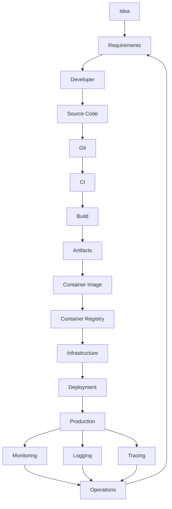

# System Map

The System Map explains how software moves from an idea to production and how production feedback returns to the engineering organization. It connects each stage of the journey to the Blueprint chapter where the concepts are explained.

This map is intentionally technology-neutral. Individual organizations may use different tools, but the major stages are common across modern software delivery systems.

## End-to-End Flow

## Feedback Loops

Production is not the end of the system. Monitoring, logging, tracing, incidents, customer feedback, reliability data, security findings, and operational toil all influence future requirements.

## Stage Reference Map

| Stage | What happens | Blueprint chapter |
| --- | --- | --- |
| Idea | A product, user, operational, security, or technical improvement is identified. | [10. Architecture](BLUEPRINT-v0.1.md#10-architecture), [11. Staff Platform Engineer](BLUEPRINT-v0.1.md#11-staff-platform-engineer) |
| Requirements | The idea is translated into desired behavior, constraints, acceptance criteria, and operational expectations. | [01. Developer World](BLUEPRINT-v0.1.md#01-developer-world), [10. Architecture](BLUEPRINT-v0.1.md#10-architecture) |
| Developer | Engineers design, implement, and validate the change locally. | [01. Developer World](BLUEPRINT-v0.1.md#01-developer-world) |
| Source Code | The implementation is represented as application code, tests, configuration, and documentation. | [01. Developer World](BLUEPRINT-v0.1.md#01-developer-world), [02. Software Delivery](BLUEPRINT-v0.1.md#02-software-delivery) |
| Git | The change is versioned, reviewed, discussed, and merged through source control workflows. | [02. Software Delivery](BLUEPRINT-v0.1.md#02-software-delivery) |
| CI | Automated systems validate the change with tests, checks, scans, and policy gates. | [02. Software Delivery](BLUEPRINT-v0.1.md#02-software-delivery), [08. Security](BLUEPRINT-v0.1.md#08-security) |
| Build | Source code is compiled, packaged, or assembled into a releasable output. | [02. Software Delivery](BLUEPRINT-v0.1.md#02-software-delivery) |
| Artifacts | Build outputs are stored with metadata so they can be promoted, audited, and deployed. | [02. Software Delivery](BLUEPRINT-v0.1.md#02-software-delivery), [08. Security](BLUEPRINT-v0.1.md#08-security) |
| Container Image | The application and its runtime dependencies are packaged into an immutable image. | [04. Containers](BLUEPRINT-v0.1.md#04-containers) |
| Container Registry | Images are stored, scanned, versioned, and made available to deployment systems. | [04. Containers](BLUEPRINT-v0.1.md#04-containers), [08. Security](BLUEPRINT-v0.1.md#08-security) |
| Infrastructure | Compute, network, storage, identity, and platform services provide the environment for the workload. | [03. Cloud Foundations](BLUEPRINT-v0.1.md#03-cloud-foundations), [05. Kubernetes](BLUEPRINT-v0.1.md#05-kubernetes) |
| Deployment | A release process updates the target environment and manages rollout, rollback, and health checks. | [02. Software Delivery](BLUEPRINT-v0.1.md#02-software-delivery), [05. Kubernetes](BLUEPRINT-v0.1.md#05-kubernetes), [07. Operating Production Systems](BLUEPRINT-v0.1.md#07-operating-production-systems) |
| Production | The software serves real users, business processes, or internal systems under operational constraints. | [07. Operating Production Systems](BLUEPRINT-v0.1.md#07-operating-production-systems), [09. Reliability](BLUEPRINT-v0.1.md#09-reliability) |
| Monitoring | Metrics describe system health, saturation, errors, latency, throughput, and service-level behavior. | [07. Operating Production Systems](BLUEPRINT-v0.1.md#07-operating-production-systems), [09. Reliability](BLUEPRINT-v0.1.md#09-reliability) |
| Logging | Events and records provide context for debugging, auditing, and understanding behavior over time. | [07. Operating Production Systems](BLUEPRINT-v0.1.md#07-operating-production-systems) |
| Tracing | Distributed traces show how requests move through services and where time or failures occur. | [07. Operating Production Systems](BLUEPRINT-v0.1.md#07-operating-production-systems), [10. Architecture](BLUEPRINT-v0.1.md#10-architecture) |
| Operations | Teams respond to alerts, investigate incidents, manage changes, improve runbooks, and feed learning back into future work. | [07. Operating Production Systems](BLUEPRINT-v0.1.md#07-operating-production-systems), [09. Reliability](BLUEPRINT-v0.1.md#09-reliability), [11. Staff Platform Engineer](BLUEPRINT-v0.1.md#11-staff-platform-engineer) |

## Detailed Flow

### 1. Idea

An idea may come from a customer need, internal product direction, technical debt, a reliability risk, a security finding, or an operational pain point. Architecture and staff-level judgment help determine whether the idea is valuable, feasible, and aligned with broader engineering strategy.

Related chapters: [10. Architecture](BLUEPRINT-v0.1.md#10-architecture), [11. Staff Platform Engineer](BLUEPRINT-v0.1.md#11-staff-platform-engineer).

### 2. Requirements

Requirements translate the idea into expected behavior and constraints. Strong requirements include functional behavior, non-functional expectations, dependencies, ownership, observability needs, security expectations, and release constraints.

Related chapters: [01. Developer World](BLUEPRINT-v0.1.md#01-developer-world), [10. Architecture](BLUEPRINT-v0.1.md#10-architecture).

### 3. Developer

The developer turns requirements into a concrete change. Platform engineering matters here because local setup, templates, paved roads, test speed, and documentation determine whether teams can work confidently.

Related chapter: [01. Developer World](BLUEPRINT-v0.1.md#01-developer-world).

### 4. Source Code

Source code includes application logic, tests, configuration, documentation, infrastructure definitions, and operational metadata. The quality of this stage affects every downstream system.

Related chapters: [01. Developer World](BLUEPRINT-v0.1.md#01-developer-world), [02. Software Delivery](BLUEPRINT-v0.1.md#02-software-delivery).

### 5. Git

Git provides version history, collaboration, review, and traceability. Pull requests connect technical changes with human review and automated validation.

Related chapter: [02. Software Delivery](BLUEPRINT-v0.1.md#02-software-delivery).

### 6. CI

Continuous integration checks whether the proposed change is safe to merge or release. CI commonly runs tests, linting, static analysis, security scanning, dependency checks, and policy validation.

Related chapters: [02. Software Delivery](BLUEPRINT-v0.1.md#02-software-delivery), [08. Security](BLUEPRINT-v0.1.md#08-security).

### 7. Build

The build stage converts source code into a runnable or deployable form. A good build is reproducible, traceable, and consistent across environments.

Related chapter: [02. Software Delivery](BLUEPRINT-v0.1.md#02-software-delivery).

### 8. Artifacts

Artifacts are the outputs of the build process. They may include binaries, packages, manifests, software bills of materials, provenance data, and release metadata.

Related chapters: [02. Software Delivery](BLUEPRINT-v0.1.md#02-software-delivery), [08. Security](BLUEPRINT-v0.1.md#08-security).

### 9. Container Image

A container image packages the application with its runtime dependencies and metadata. Images make deployments more consistent, but they also introduce concerns around base images, vulnerabilities, size, caching, and provenance.

Related chapter: [04. Containers](BLUEPRINT-v0.1.md#04-containers).

### 10. Container Registry

A container registry stores images for deployment systems. Registries support versioning, scanning, promotion, access control, retention, and auditability.

Related chapters: [04. Containers](BLUEPRINT-v0.1.md#04-containers), [08. Security](BLUEPRINT-v0.1.md#08-security).

### 11. Infrastructure

Infrastructure provides the runtime environment: compute capacity, networking, storage, identity, policy, and platform services. In many organizations, Kubernetes sits on top of cloud primitives and provides a shared workload orchestration layer.

Related chapters: [03. Cloud Foundations](BLUEPRINT-v0.1.md#03-cloud-foundations), [05. Kubernetes](BLUEPRINT-v0.1.md#05-kubernetes), [06. Platform Engineering](BLUEPRINT-v0.1.md#06-platform-engineering).

### 12. Deployment

Deployment applies a release to an environment. A mature deployment system supports progressive rollout, health checks, rollback, approvals where appropriate, and clear visibility into what changed.

Related chapters: [02. Software Delivery](BLUEPRINT-v0.1.md#02-software-delivery), [05. Kubernetes](BLUEPRINT-v0.1.md#05-kubernetes), [07. Operating Production Systems](BLUEPRINT-v0.1.md#07-operating-production-systems).

### 13. Production

Production is where software faces real load, real users, real dependencies, and real failure modes. Production readiness depends on architecture, reliability, security, operations, and platform support.

Related chapters: [07. Operating Production Systems](BLUEPRINT-v0.1.md#07-operating-production-systems), [08. Security](BLUEPRINT-v0.1.md#08-security), [09. Reliability](BLUEPRINT-v0.1.md#09-reliability).

### 14. Monitoring

Monitoring uses metrics to answer whether the system is healthy and whether users are receiving the expected service. Monitoring is most useful when connected to service-level objectives and actionable alerts.

Related chapters: [07. Operating Production Systems](BLUEPRINT-v0.1.md#07-operating-production-systems), [09. Reliability](BLUEPRINT-v0.1.md#09-reliability).

### 15. Logging

Logging records events that help teams understand what happened. Effective logs support debugging, auditability, incident investigation, and behavior analysis without exposing sensitive data.

Related chapters: [07. Operating Production Systems](BLUEPRINT-v0.1.md#07-operating-production-systems), [08. Security](BLUEPRINT-v0.1.md#08-security).

### 16. Tracing

Tracing follows requests across service boundaries. It is especially useful in distributed systems where latency, dependency behavior, and partial failure can be difficult to understand from metrics or logs alone.

Related chapters: [07. Operating Production Systems](BLUEPRINT-v0.1.md#07-operating-production-systems), [10. Architecture](BLUEPRINT-v0.1.md#10-architecture).

### 17. Operations

Operations includes responding to alerts, communicating during incidents, executing runbooks, managing changes, reviewing failures, reducing toil, and improving the platform. Operations produces learning that should shape future requirements and architecture.

Related chapters: [07. Operating Production Systems](BLUEPRINT-v0.1.md#07-operating-production-systems), [09. Reliability](BLUEPRINT-v0.1.md#09-reliability), [11. Staff Platform Engineer](BLUEPRINT-v0.1.md#11-staff-platform-engineer).
