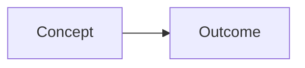

# Lesson title

## Learning Objectives

- State the concrete skills or explanations the learner should be able to perform after the lesson.
- Keep objectives observable, specific, and aligned with Blueprint v0.1 chapter scope.

## Why This Matters

Explain the production, delivery, reliability, security, or developer-experience reason this topic matters. Connect the lesson to real decisions a platform engineer must make.

## Mental Model

Introduce the simplest durable model for reasoning about the topic. Prefer relationships, responsibilities, boundaries, and tradeoffs over tool-specific memorization.

## Where It Fits

Describe where the topic belongs in the idea-to-production path and which Blueprint v0.1 chapter owns the concept. Link to related chapter material using relative links when content exists.

## Deep Dive

Develop the concept in a clear sequence. Explain the underlying mechanics, important terminology, operational behavior, and boundaries of the abstraction.

## Visual Diagram

Use a Mermaid diagram only when it clarifies relationships, data flow, control flow, ownership, or failure paths. Keep labels short and explain the diagram before or after it.

## Practical Example

Show how the concept appears in a realistic engineering situation. Use commands, configuration, code, or decision examples only when they improve understanding.

## Common Mistakes

- Describe common misunderstandings, unsafe shortcuts, or oversimplifications.
- Explain why each mistake matters in production.

## Production Reality

Explain how the concept behaves under scale, failure, team ownership, cost pressure, security requirements, or operational constraints.

## Engineering Story

Tell a concise scenario that demonstrates the concept through symptoms, investigation, decision-making, and outcome.

## Interview Questions

- Ask questions that test reasoning rather than memorization.
- Include questions that reveal tradeoff awareness and production judgment.

## Key Takeaways

- Summarize the durable points the learner should remember.
- Keep takeaways brief, accurate, and useful for review.

## Further Reading

List only relevant internal relative links and durable external references when they materially help the learner.
